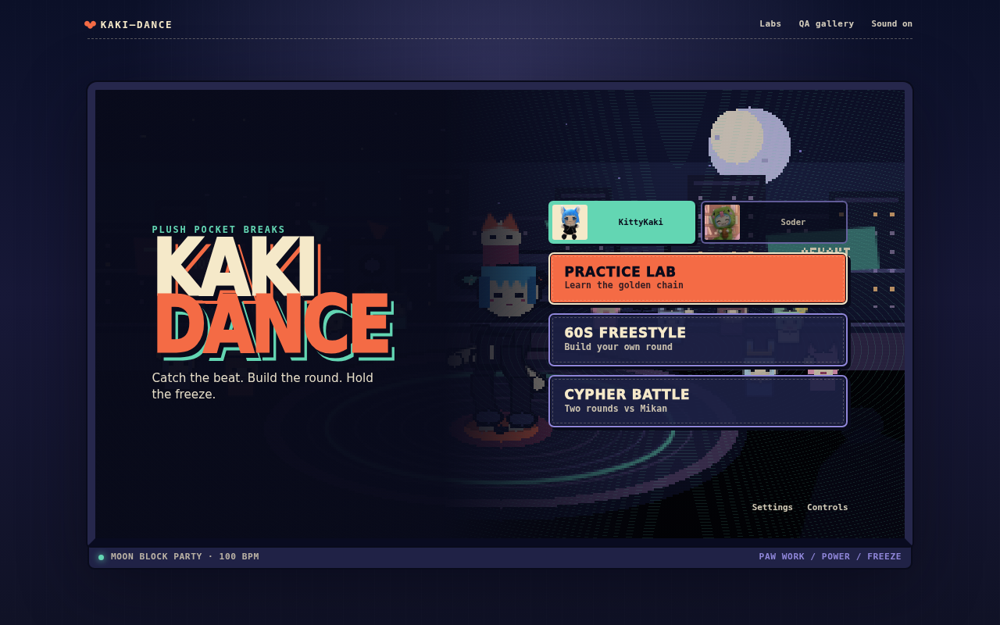

# Kaki-Dance

**Catch the beat. Build the round. Hold the freeze.**

Kaki-Dance is a standalone browser breaking game starring KittyKaki and Soder.
It is a freestyle dance toy rather than a note highway: choose moves, connect
declared stances, answer musical accents, manage power momentum, and actively
balance freezes.



## Play locally

No build is required.

```bash
npm run serve
```

Open <http://127.0.0.1:4177>. The first mode selection unlocks Web Audio.
The same checked-in files deploy unchanged to GitHub Pages.

## Included vertical slice

- KittyKaki articulated cat rig and Soder dedicated coil rig.
- Practice Lab with the complete golden chain:
  `Basic Rock → Go Down → 6-Step → Windmill → Baby Freeze → Clean Get-Up`.
- 60-second Freestyle.
- Alternating two-round Cypher Battle against a same-rules AI, with a tiebreak
  only when the normal rounds tie.
- 25 authored moves: 5 toprock, 4 go-downs, 1 recovery, 6 footwork, 5 power,
  and 4 freezes.
- Five-category scoring: musicality, vocabulary, originality, technique, and
  execution.
- Stamina, momentum, player-corrected freeze balance, crowd heat, repeat decay,
  buffered transitions, and useful invalid-input feedback.
- Deterministic best-moment replay frame in the post-round judgment.
- Keyboard, gamepad, and independent multitouch input.
- Moonlit Oekaki Block Party stage, twelve KemonoKaki-inspired crowd profiles,
  reactive DJ/crowd/effects, and an original local 100 BPM breakbeat.
- Animation Lab, Rhythm Lab, and 114-frame deterministic QA gallery.

## Controls

Simple Controls are the default.

| Input | Keyboard | Gamepad | Touch |
| --- | --- | --- | --- |
| Direction / balance | WASD or arrows | Left stick | Radial stick |
| Context action / transition | Space | A | A |
| Style / variation | F or X | X | S |
| Power / extend | Shift or Y | Y | P |
| Freeze / hold | T or B | B | F |
| Pause | Escape or P | Start | Pause |

Simple Action chooses a compatible move from the current stance. Hold down and
press Action during toprock to go down; press Action on the floor for 6-Step;
hold up and press Action after a freeze to get up. Direction, Action, Style,
Power, and Freeze keys are remappable in the Controls panel.

Advanced Controls select families directly:

- Q — toprock
- E — footwork
- F — power
- T — freeze
- Space — transition or accent

## Development tools

- [Animation and Rhythm Labs](lab.html) — scrub every move, change cadence and
  speed, mirror it, force stamina/balance, inspect skeleton/contact/COM/support
  overlays, test legal transitions, capture PNGs, and inspect the audio clock.
- [Deterministic QA gallery](qa.html) — entry, midpoint, accent, and exit frames
  for all moves plus golden-chain and failure variants. Filter with
  `qa.html?family=freeze`.

## Verification

```bash
npm run verify
```

This runs syntax checks and 32 native Node tests using a fake audio clock. The
suite covers beat math, pause/resume, latency, fixed-step catch-up, input edges,
transition legality, every declared contact at 101 phases for both characters,
IK bounds, balance, stamina, extensions, scoring decay, AI parity, deterministic
replay, tiebreaks, storage migration, audio headers, and asset dimensions.

For browser capture:

```bash
npm install
npm run serve
# in a second terminal
npm run qa:browser
```

The browser pass writes screenshots and a machine-readable report under
`docs/images/qa-browser/`.

## Architecture

```text
AudioContext.currentTime
          │
       BeatClock ────────────────┐
          │                      │
  120 Hz DanceSimulation        │
          │                      │
  MoveSession / contacts / AI   │
          │                      │
   immutable gameplay snapshot  │
          ├──────── Canvas 2D renderer at 384×216
          ├──────── semantic Web Audio effects
          └──────── host callbacks / deterministic replay
```

Gameplay truth lives in `js/dance` and `js/animation`. The renderer consumes
named contacts and solved rig anchors; it does not decide stance eligibility,
balance, timing, or score. The public entry point is:

```js
const game = await createKakiDance({
  host,
  input,
  audio,
  storage,
  settings,
  profile,
  onExit,
  onRoundComplete,
  onBattleComplete,
  qaScene,
});

game.start();
game.pause();
game.resume();
game.restart();
game.destroy();
game.getSnapshot();
```

See [the architecture decision](docs/ADR-001-STANDALONE-DANCE-CORE.md) and
[the Kaki-Surf portability audit](docs/AUDIT-KAKI-SURF.md).

## Authoring and production

- [Move references](docs/MOVE-REFERENCES.md)
- [Move-authoring guide](docs/MOVE-AUTHORING.md)
- [Offline Blender proxy pipeline](tools/blender/README.md)
- [Beatmap schema](docs/BEATMAP-SCHEMA.md)
- [Asset provenance](docs/ASSET-PROVENANCE.md)
- [Suno Kaki-Dance brief](docs/SUNO-KAKI-DANCE.md)
- [Performance report](docs/PERFORMANCE.md)
- [Known limitations](docs/KNOWN-LIMITATIONS.md)
- [Prioritized next content](docs/NEXT-CONTENT.md)

The checked-in track is generated offline and has no sampled or cloud-fetched
material. Suno can be used later for a sparse Japanese female vocal version;
the production prompt and minimal lyrics are documented without making Suno a
runtime dependency.
