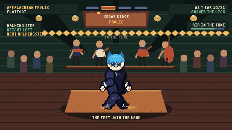

# Kaki-Dance

**The band plays the tune. Your feet answer.**

Kaki-Dance is a 384×216 Canvas 2D rhythm game starring KittyKaki and Soder.
It now has two complete, distinct rhythm structures:

```text
APPALACHIAN FROLIC                 MEASURE MATCH
foundation → build a lick          listen to one measure
→ trade licks → turnaround         → copy the next measure
→ open frolic                      → style → finish
```



## Play locally

No build is required.

```bash
npm run serve
```

Open <http://127.0.0.1:4177>. The first mode selection unlocks Web Audio. The
same checked-in files remain compatible with static GitHub Pages.

## Appalachian Frolic vertical slice

- Original two-bar count-in and 32-bar AABB old-time tune, “Board & Bow,” at
  120 BPM with fiddle, clawhammer-inspired banjo, guitar, bass, and local
  stems.
- Continuous freestyle across A1, trade calls and responses in A2, freer B1,
  stronger B2 breakdown, four turnaround windows, and a controlled ending.
- Three qualified gameplay profiles with different pose language, contacts,
  transition availability, and sound: **Flatfoot**, **Buck**, and **Clog**.
- Twelve reusable movement families plus turnaround and ending, represented at
  96 PPQ with entry/exit foot, contacts, articulations, root motion, authored
  successors, animation IDs, sound groups, and source notes.
- Phrase judging across **Time, Tune, Flow, Footwork, and Spirit**, with
  restraint, motif return, anti-spam decay, exact/simplified/varied/
  complementary trade answers, and musical-ending credit.
- Immediate contact sound and body micro-response at input time, even when the
  full-body transition waits for a safe boundary.
- **Step Shed**, a five-lesson learn-by-doing practice board.
- One warm community hall, resonant board, visible string band, and phrase-aware
  audience without hillbilly or saloon caricature.
- Six lazy hero/profile packs. Only the selected 1024² indexed atlas is
  resident (4 MiB decoded).

Both KittyKaki and Soder retain a complete shared biped. Soder is a padded
snake kigurumi over two arms, two hands, two legs, and two feet—not a coil or
tail-body character.

## Measure Match vertical slice

- One polished 16-bar sequence at 100 BPM and 4/4.
- Count-in, seven authored call/copy pairs and a freeze/get-up resolution.
- One required input for the complete beginner song:
  **Space**, gamepad **A**, or the large touch **PAW**.
- A sixteen-cell measure strip grouped into four beats; no falling-note
  highway and no hidden stance vocabulary in the player-facing rules.
- Nearest-unmatched-target timing, signed early/late errors, misses, extras,
  separate optional Style cells, phrase streaks and five immediate grades.
- Predictive choreography selected during CALL. Atlas animation proceeds from
  the audio clock and never restarts when the player taps.
- Golden-chain escalation:
  `Basic Rock → Go Down → 6-Step → Windmill → Baby Freeze → Clean Get-Up`.
- KittyKaki and Soder use authored, trimmed, indexed sprite atlases. Soder has
  ordinary plush biped anatomy inside a padded snake kigurumi; the tail is
  decorative and never supports weight.

Practice is the interactive opening tutorial. Freestyle and Cypher Battle
remain under **More modes · experimental** and are not expanded by this
milestone.

## Controls

| Appalachian Frolic | Keyboard | Gamepad | Touch |
| --- | --- | --- | --- |
| STEP / alternating foundation | Space | A | STEP |
| BRUSH / shuffle, scuff, slide | F | X | BRUSH |
| DRIVE / backstep, chug, double | Left Shift | Y | DRIVE |
| LICK / phrase, turn, ending | T | B | LICK |
| Travel / cross modifier | WASD or arrows | Left stick | Left stick |
| Pause | Escape / P | Start | Pause |

STEP alone creates a valid groove but cannot earn an elite result. Directions,
subdivision timing, vocabulary, restraint, trade variation, and musical
endings form the advanced layer.

| Measure Match | Keyboard | Gamepad | Touch |
| --- | --- | --- | --- |
| Copy a lit cell | Space | A | PAW |
| Pause | Escape / P | Start | Pause |

Optional controls are introduced only after the copy rule:

| Optional action | Keyboard | Gamepad |
| --- | --- | --- |
| Choreography direction | Left / Right | Left stick |
| Style cell | F / X | X |
| Prompted power variation | Shift / Y | Y |
| Phrase-ending freeze / advanced hold | T / B | B |

The direct Q/E/F/T move-family controls remain available only in the
experimental advanced modes.

Judgment, foot-audio, and full-body visual offsets are independently
configurable in Settings.

## Hero production stack

Public pixels and gameplay anatomy are deliberately separate:

```text
AudioContext.currentTime
          │
   Measure Match scheduler ─── authored target cells / judgments
          │
   normalized clip phase
          ├── hidden BipedRig: contacts, COM, support, eligibility, replay
          └── public atlas: authored occlusion, silhouette, costume, face
```

Each hero has 225 trimmed drawings across nine clips:

- Idle/Groove
- Basic Rock
- Go Down
- 6-Step
- Windmill
- Baby Freeze
- Clean Get-Up
- Victory
- Miss/Recovery

The runtime loads the selected hero's two 1024×1024 indexed PNG pages and
metadata. The rejected procedural renderer is retained only as an optional
Hero Lab debug layer.

Frolic uses a separate atlas boundary: 164 drawings across fourteen movement
clips and six transition clips per hero/profile pack. The deterministic source
is `KakiFrolicSharedBiped`, a 30-bone/control Blender rig with paired
heel/toe/foot-IK and knee-pole controls plus non-contact Soder costume
controls. Public sprites receive a deliberate indexed-pixel cleanup/export
pass and strict plant/joint/silhouette lint.

## Development and review tools

- [Authored atlas review board](hero-rescue.html) — ten approval poses,
  silhouettes, random-frame sheets, normal/quarter-speed videos, gameplay
  capture and the explicitly rejected `ce32ead` baseline.
- [Hero Lab](hero-lab.html) — both heroes at identical phase; native, 2× and
  4× nearest-neighbor; full/half/quarter speed; frame stepping; silhouettes;
  semantic skeleton, contacts, COM, support, anatomical labels; per-segment
  depth colors; atlas bounds and pivot; effects/shake disabled; automatic
  16-bar sequence.
- [Appalachian Footwork Lab](frolic-lab.html) — hero/profile/move/entry-foot
  selectors; native stage and 4× neutral preview; speed and frame hold;
  skeleton, contacts, COM, root trail and bounds; transition bridge preview;
  atlas-page inspection; metronome; and isolated foot percussion.
- [Animation and Rhythm Labs](lab.html) — legacy move development and audio
  clock inspection.
- [Deterministic QA gallery](qa.html) — legacy semantic-rig and advanced-mode
  sweeps.

## Verification

```bash
npm run verify
```

Current checked-in result: **79 JavaScript modules pass syntax validation and
87/87 native tests pass**.

Browser and visual proof:

```bash
npm install
npm run serve
# in a second terminal
npm run qa:browser
npm run qa:heroes
npm run qa:measure:capture
npm run qa:frolic
npm run qa:frolic:capture
npm run qa:frolic:chorus # real-time 68-second end-to-end run
```

The native suite covers atlas metadata and indexed PNGs, stable pivots,
semantic anchors, contacts and segment depths; deterministic atlas playback;
public-renderer separation from procedural limbs; audio-clock math; latency,
pause/resume and loop wrapping; nearest unmatched target matching; one-input
ownership; early/late errors; misses, extras and optional Style; one-button
tutorial completion; failed-tutorial replay; predictive sequence escalation;
clean input destruction; and the existing exhaustive semantic-rig geometry,
contact, transition, scoring and replay tests.

Frolic coverage adds exact AABB/state boundaries, trade timing and answer
classes, entry/exit-foot graph legality, automatic foundation alternation,
spam decay versus clean variation, musical motif repetition, turnaround
windows, style availability, contact/clip bounds, audio/animation agreement,
six indexed atlas packs, planted-foot and joint lint, deterministic simulation,
semantic input parity, one-pack lazy loading, exact local audio dimensions,
shared Blender anatomy, and no remote runtime dependency.

Browser outputs live under:

- `docs/images/qa-browser/`
- `docs/images/measure-match/final/`
- `docs/images/appalachian/final/`
- `docs/images/appalachian/loops/`

The Frolic final folder includes the native gameplay frame, full-chorus
results, stage/neutral/diagnostic approval boards, touch proof, Footwork Lab,
and machine-readable browser/capture reports.

## Authoring and production

- [Measure Match milestone report](docs/MEASURE-MATCH-MILESTONE.md)
- [Appalachian Frolic design](docs/appalachian-frolic-design.md)
- [Cultural sources and movement provenance](docs/appalachian-sources.md)
- [Frolic animation bible](docs/appalachian-animation-bible.md)
- [Frolic audio pipeline](docs/appalachian-audio.md)
- [Rejected procedural rescue and atlas replacement](docs/HERO-RESCUE-REPORT.md)
- [Beatmap v2 schema](docs/BEATMAP-SCHEMA.md)
- [Offline atlas and shared-armature pipeline](tools/blender/README.md)
- [Asset provenance](docs/ASSET-PROVENANCE.md)
- [Performance report](docs/PERFORMANCE.md)
- [Known limitations](docs/KNOWN-LIMITATIONS.md)
- [Architecture decision](docs/ADR-001-STANDALONE-DANCE-CORE.md)

The checked-in track and atlases are local runtime assets. There are no
runtime AI, cloud, streaming, or generation requests.

Rebuild Frolic assets:

```bash
npm run audio:frolic:build
npm run art:frolic:build
npm run rig:frolic:build
```

To author a new step, add its 96 PPQ definition to
`js/appalachian/footwork-catalog.js`, add successors/bridge tags to
`footwork-transition-graph.js`, author the style poses and contacts in
`tools/art/appalachian_pose_library.py`, regenerate, inspect every profile in
the Footwork Lab, then run `npm run verify` and the Frolic browser capture.
To author a tune, provide the musical tick map in `tune-map.js`, create a local
master/stems build, and make the audio clock—not animation frames—the shared
timeline.
