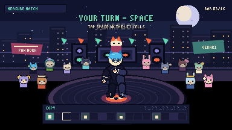

# Kaki-Dance

**Listen to one bar. Copy it. Make it yours.**

Kaki-Dance is a 384×216 Canvas 2D rhythm game starring KittyKaki and Soder.
The primary game is Measure Match:

```text
LISTEN TO ONE MEASURE
        ↓
COPY IT DURING THE NEXT MEASURE
        ↓
ADD OPTIONAL STYLE
        ↓
LAND THE PHRASE-ENDING FREEZE
```



## Play locally

No build is required.

```bash
npm run serve
```

Open <http://127.0.0.1:4177>. The first mode selection unlocks Web Audio. The
same checked-in files remain compatible with static GitHub Pages.

## Measure Match vertical slice

- One polished 16-bar sequence at 100 BPM and 4/4.
- Count-in, seven authored call/copy pairs and a freeze/get-up resolution.
- One required input for the complete beginner song:
  **Space**, gamepad **A**, or the large touch **PAW**.
- A sixteen-cell measure strip grouped into four beats; no falling-note
  highway and no hidden stance vocabulary in the player-facing rules.
- Nearest-unmatched-target timing, signed early/late errors, misses, extras,
  separate optional Style cells, phrase streaks and five immediate grades.
- Predictive choreography selected during CALL. Atlas animation proceeds from
  the audio clock and never restarts when the player taps.
- Golden-chain escalation:
  `Basic Rock → Go Down → 6-Step → Windmill → Baby Freeze → Clean Get-Up`.
- KittyKaki and Soder use authored, trimmed, indexed sprite atlases. Soder has
  ordinary plush biped anatomy inside a padded snake kigurumi; the tail is
  decorative and never supports weight.

Practice is the interactive opening tutorial. Freestyle and Cypher Battle
remain under **More modes · experimental** and are not expanded by this
milestone.

## Controls

| Measure Match | Keyboard | Gamepad | Touch |
| --- | --- | --- | --- |
| Copy a lit cell | Space | A | PAW |
| Pause | Escape / P | Start | Pause |

Optional controls are introduced only after the copy rule:

| Optional action | Keyboard | Gamepad |
| --- | --- | --- |
| Choreography direction | Left / Right | Left stick |
| Style cell | F / X | X |
| Prompted power variation | Shift / Y | Y |
| Phrase-ending freeze / advanced hold | T / B | B |

The direct Q/E/F/T move-family controls remain available only in the
experimental advanced modes.

## Hero production stack

Public pixels and gameplay anatomy are deliberately separate:

```text
AudioContext.currentTime
          │
   Measure Match scheduler ─── authored target cells / judgments
          │
   normalized clip phase
          ├── hidden BipedRig: contacts, COM, support, eligibility, replay
          └── public atlas: authored occlusion, silhouette, costume, face
```

Each hero has 225 trimmed drawings across nine clips:

- Idle/Groove
- Basic Rock
- Go Down
- 6-Step
- Windmill
- Baby Freeze
- Clean Get-Up
- Victory
- Miss/Recovery

The runtime loads the selected hero's two 1024×1024 indexed PNG pages and
metadata. The rejected procedural renderer is retained only as an optional
Hero Lab debug layer.

## Development and review tools

- [Authored atlas review board](hero-rescue.html) — ten approval poses,
  silhouettes, random-frame sheets, normal/quarter-speed videos, gameplay
  capture and the explicitly rejected `ce32ead` baseline.
- [Hero Lab](hero-lab.html) — both heroes at identical phase; native, 2× and
  4× nearest-neighbor; full/half/quarter speed; frame stepping; silhouettes;
  semantic skeleton, contacts, COM, support, anatomical labels; per-segment
  depth colors; atlas bounds and pivot; effects/shake disabled; automatic
  16-bar sequence.
- [Animation and Rhythm Labs](lab.html) — legacy move development and audio
  clock inspection.
- [Deterministic QA gallery](qa.html) — legacy semantic-rig and advanced-mode
  sweeps.

## Verification

```bash
npm run verify
```

Browser and visual proof:

```bash
npm install
npm run serve
# in a second terminal
npm run qa:browser
npm run qa:heroes
npm run qa:measure:capture
```

The native suite covers atlas metadata and indexed PNGs, stable pivots,
semantic anchors, contacts and segment depths; deterministic atlas playback;
public-renderer separation from procedural limbs; audio-clock math; latency,
pause/resume and loop wrapping; nearest unmatched target matching; one-input
ownership; early/late errors; misses, extras and optional Style; one-button
tutorial completion; failed-tutorial replay; predictive sequence escalation;
clean input destruction; and the existing exhaustive semantic-rig geometry,
contact, transition, scoring and replay tests.

Browser outputs live under:

- `docs/images/qa-browser/`
- `docs/images/measure-match/final/`

## Authoring and production

- [Measure Match milestone report](docs/MEASURE-MATCH-MILESTONE.md)
- [Rejected procedural rescue and atlas replacement](docs/HERO-RESCUE-REPORT.md)
- [Beatmap v2 schema](docs/BEATMAP-SCHEMA.md)
- [Offline atlas and shared-armature pipeline](tools/blender/README.md)
- [Asset provenance](docs/ASSET-PROVENANCE.md)
- [Performance report](docs/PERFORMANCE.md)
- [Known limitations](docs/KNOWN-LIMITATIONS.md)
- [Architecture decision](docs/ADR-001-STANDALONE-DANCE-CORE.md)

The checked-in track and atlases are local runtime assets. There are no
runtime AI, cloud, streaming, or generation requests.
